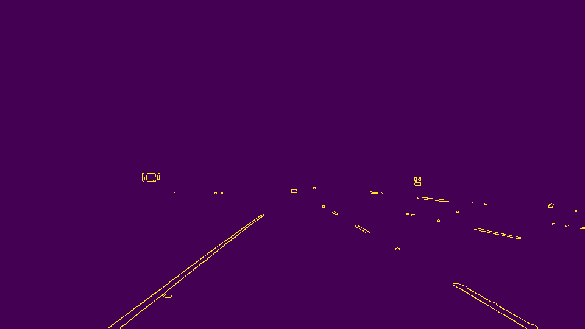
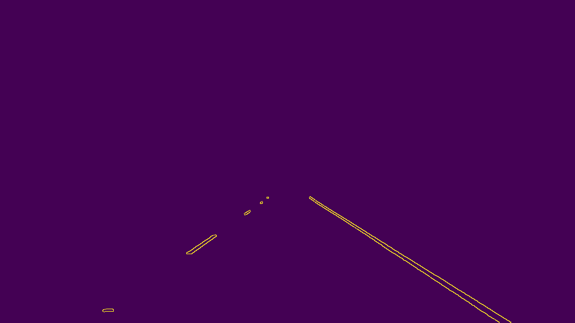

# **Finding Lane Lines on the Road** 

Overview
---

When we drive, we use our eyes to decide where to go.  The lines on the road that show us where the lanes are act as our constant reference for where to steer the vehicle.  Naturally, one of the first things we would like to do in developing a self-driving car is to automatically detect lane lines using an algorithm.

This repo contains my solution to Udacity's self-drving course project, [Finding Lane Lines on the Road](https://github.com/udacity/CarND-LaneLines-P1)

---

### Pipeline Description

#### 1. Color Filtering

In the assignment, highway lanes are in either yellow or white. To remove noice, the first step is to only select yellow and white color in the RGB space. With additional research, HSL color space performs particular well in detecting yellow and white lanes under shades, and which helps improving the quality in finding lanes in the challenging videos

```python
  converted_img = cv2.cvtColor(img, cv2.COLOR_RGB2HLS)
  lower = np.array([ 10,  0,100])
  upper = np.array([ 40,255,255])
  yellow_mask = cv2.inRange(converted_img, lower, upper)

  lower = np.array([  0, 200, 0])
  upper = np.array([255,255,255])
  white_mask = cv2.inRange(converted_img, lower, upper)

  mask = cv2.bitwise_or(yellow_mask, white_mask)
  masked_img = cv2.bitwise_and(converted_img, converted_img, mask = mask)
```

Original images vs. Color filtered images

 

 

 

 

 

 

#### 2. Apply gray scale and gaussian transformation
Before detect the shape in the pictures, we need to apply the gray scale transformation on the color filtered images. Both the grayscale conversion and gaussian noice are applied at this step

Original images vs. gray scaled images

 

 

 

 

 

 

#### 3. Canny edge detection
Next is to detect edge with low error rate from the gray scaled images. Canny transformation has applied at this step.

Original images vs. Canny transformed images

 

 

 

 

 

 

#### 4. Region of Interest Selection
This step is to keep the region defined by the ploygon, so that we only render the current car's lane

Original images vs. marked edges

 

 

 

 

 

 

#### 5. Hough transformation to detect all the lines

Here are the input parameters to `cv2.HoughLinesP`

```python
  rho = 1
  theta = np.pi/180 
  threshold = 10    
  min_line_len = 20 
  max_line_gap = 200    # A big gap is needed for the tolerance of the dashed line
```

#### 6. Line optimization: filter out bad ones and extend the lines for the dashed lane

Due to noices (especailly in the video), there may be bad line segments included in the image. I used empirical filtering rules to detect obvious bad lines. For example, each line is formulized as `y = mx + b`. Based on the observation, the left lane's `m` is normally less than `-0.5`, while the right lane's `m` is greater than `0.5`. In addition, `b` value shall follow some patterns. For example, when `y = 0`, the cooresponding `x` shall fall in corresponding expected ranges for left and right lane.

For the dashed lane, we may miss the bottom parts in line rendering. We extend the bottom lines with same `m` / `b` parameters for a consistent length for left and right lanes.

#### 7. Draw the lanes on the original images

Original images vs. marked edges

 

 

 

 

 

 

#### Video clips

The video is processed as a stream of individual images

```python
  for file_name in os.listdir("test_videos/"):
    clip = VideoFileClip('test_videos/' + file_name)
    new_clip = clip.fl_image(process_image)
    output_file = 'test_videos_output/' + file_name
    new_clip.write_videofile(output_file, audio=False)
```

- [White Lanes Video](https://www.dropbox.com/s/bw9gah8jrgmcqth/solidWhiteRight.mp4?dl=0)
- [Yellow Lanes Video](https://www.dropbox.com/s/penftep9t5ly1r2/solidYellowLeft.mp4?dl=0)
- [Challenge Video](https://www.dropbox.com/s/bxpq2a8tralfqwt/challenge.mp4?dl=0)


### Potential Issues with the current pipeline
The project was reasonably detect lanes in the videos, however there are a lot more thing that can be improved

#### Handle Noices in the image
In the `challenge` video, when the car drives through the shaped area under bushes or the lane is mixed with multiple colors on the groud, the current algorithm may detect multiple bad lines.  

#### The dashed lane line isn't drawn straightly sometimes
There are multiple lines detected for a lane line, especially the dashed line. I still need to come up with an "averaged" line for that, otherwise the line doesn't look straight. This makes things even worse when we need to extend the line to the bottom for the dashed lane lines.

Another thing is that it won't work for steep (up or down) roads because the region of interest mask is assumed from the center of the image.

For steep roads, we first need to detect the horizontal line (between the sky and the earth) so that we can tell up to where the lines should extend.

### Future Improvements

#### Draw the "averaged" line along the lane
I need to merge mulitple line segments into a long line with "averaged" `m` and `b` (`y = mx + b`). This can make the line looks a lot better

#### Effective detect wrong lines
In the `challenge` video, some bad lines are detected due to the noices in the images. I think this can be further filtered out based on the lane lines' pattern. For example we expects `m` and `b` of each line shall be consistent.

### Handle curved lanes
Although there is no curved lanes in the video, it is pretty common on the real roads. We may need to leverage perspective transformation and ploy fitting lines, rather than assumeing the lines are straight.

## What if the region of interest mask is not in the center
For many mountain roads with sharp turns, the region of interest may not be always in the center. We need to adjust it based on the shape of the roads

### Handle steep roads (up or down) at San Francisco
We may need to detect the boundary between the sky and land, so that we know where to stop and avoid drawing the lines to the sky. 

