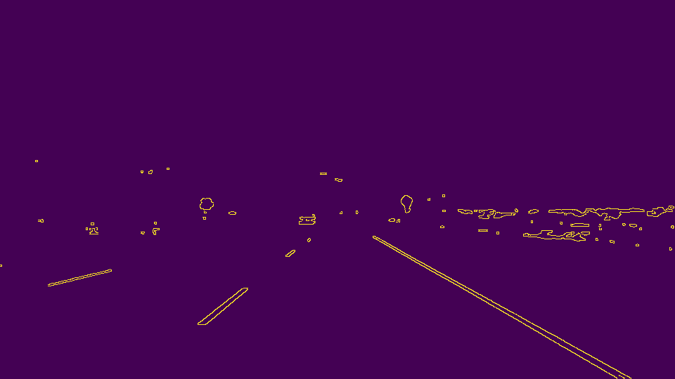
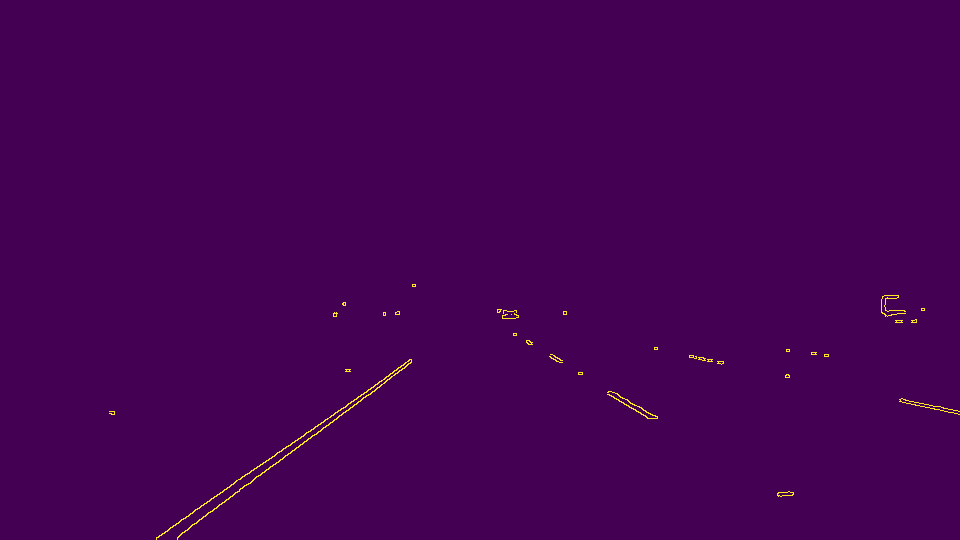
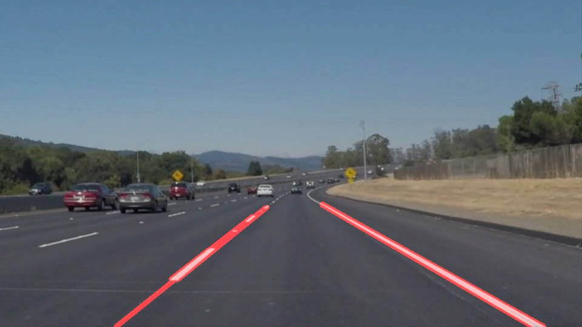

# **Finding Lane Lines on the Road** 

Overview
---

When we drive, we use our eyes to decide where to go.  The lines on the road that show us where the lanes are act as our constant reference for where to steer the vehicle.  Naturally, one of the first things we would like to do in developing a self-driving car is to automatically detect lane lines using an algorithm.

This repo contains my solution to Udacity's self-drving course project, [Finding Lane Lines on the Road](https://github.com/udacity/CarND-LaneLines-P1)

---

### Pipeline Description

#### 1. Color Filtering

In the assignment, highway lanes are in either yellow or white. To remove noice, the first step is to only select yellow and white color in the RGB space.

```python
  lower = np.array([190,190,0])
  upper = np.array([255,255,255])
  yellow_mask = cv2.inRange(img, lower, upper)

  lower = np.array([200,200,200])
  upper = np.array([255,255,255])
  white_mask = cv2.inRange(img, lower, upper)

  mask = cv2.bitwise_or(yellow_mask, white_mask)

  cv2.bitwise_and(img, img, mask = mask)
```

Original images vs. Color filtered images

 

 

 

 

 

 

#### 2. Apply gray scale and gaussian transformation
Before detect the shape in the pictures, we need to apply the gray scale transformation on the color filtered images. Both the grayscale conversion and gaussian noice are applied at this step

Original images vs. gray scaled images

 

 

 

 

 

 

#### 3. Canny edge detection
Next is to detect edge with low error rate from the gray scaled images. Canny transformation has applied at this step.

Original images vs. Canny transformed images

 

 

 

 

 

 

#### 4. Region of Interest Selection
This step is to keep the region defined by the ploygon, so that we only render the current car's lane

Original images vs. marked edges

 

 

 

 

 

 

#### 5. Hough transformation to detect all the lines

Here are the input parameters to `cv2.HoughLinesP`

```python
  rho = 1
  theta = np.pi/180 
  threshold = 5     
  min_line_len = 5 
  max_line_gap = 150    # A big gap is needed for the tolerance of the dashed line
```

#### 6. Filter out bad lines

Due to noices (especailly in the video), there may be bad line segments included in the image. I used empirical filtering rules to detect obvious bad lines. For example, each line is formulized as `y = mx + b`. Based on the observation, the left lane's `m` is normally less than `-0.5`, while the right lane's `m` is greater than `0.5`. In addition, `b` value shall follow some patterns.

#### 7. Draw the lanes on the original images

Original images vs. marked edges

 

 

 

 

 

 

#### Video clips
- [White Lanes Video](test_videos_output/solidWhiteRight.mp4)
- [Yellow Lanes Video](test_videos_output/solidYellowLeft.mp4)
- [Challenge Video](test_videos_output/challenge.mp4)
