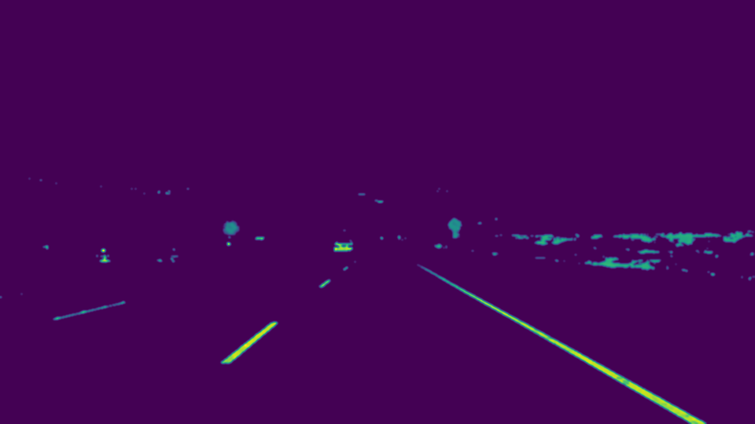
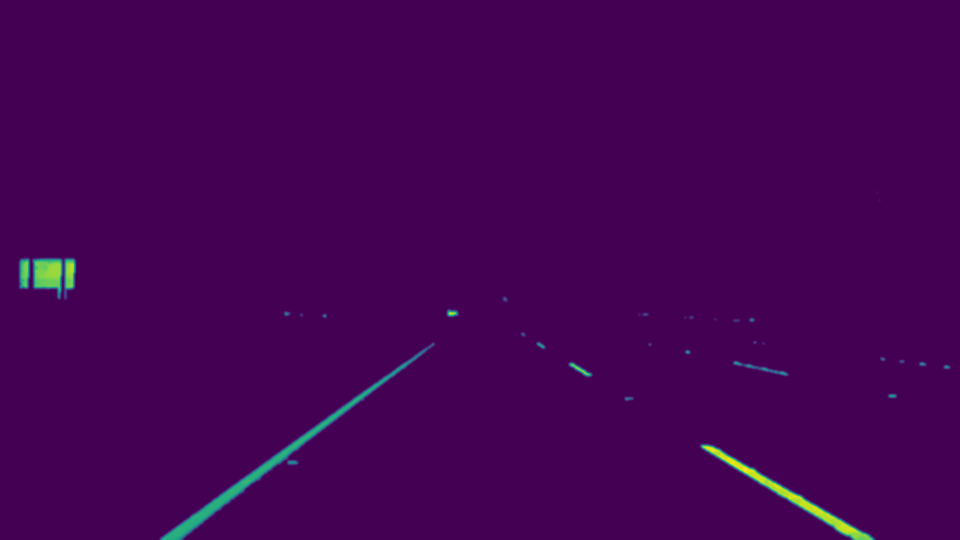
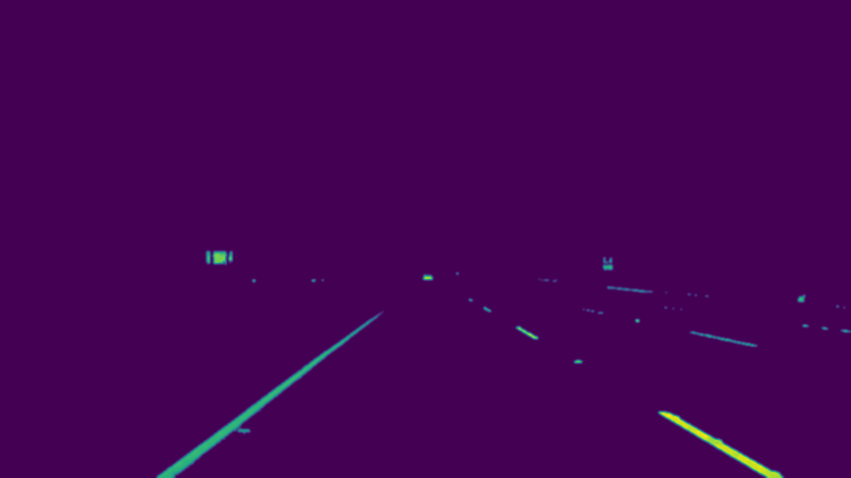
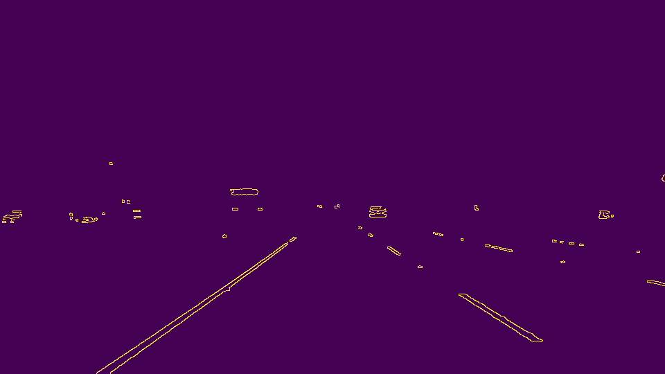

# **Finding Lane Lines on the Road** 

Overview
---

When we drive, we use our eyes to decide where to go.  The lines on the road that show us where the lanes are act as our constant reference for where to steer the vehicle.  Naturally, one of the first things we would like to do in developing a self-driving car is to automatically detect lane lines using an algorithm.

This repo contains my solution to Udacity's self-drving course project, [Finding Lane Lines on the Road](https://github.com/udacity/CarND-LaneLines-P1)

---

### Pipeline Description

#### 1. Color Filtering

In the assignment, highway lanes are in either yellow or white. To remove noice, the first step is to only select yellow and white color in the RGB space.

Original images vs. Color filtered images

 

 

 

 

 

 

#### 2. Apply gray scale
Before detect the shape in the pictures, we need to apply the gray scale transformation on the color filtered images. Both the grayscale conversion and gaussian noice are applied at this step

Original images vs. gray scaled images

 

 

 

 

 

 

#### 2. Canny edge detection
Next is to detect edge with low error rate from the gray scaled images. Canny transformation has applied at this step.

Original images vs. Canny transformed images

 

 

 

 

 

 
